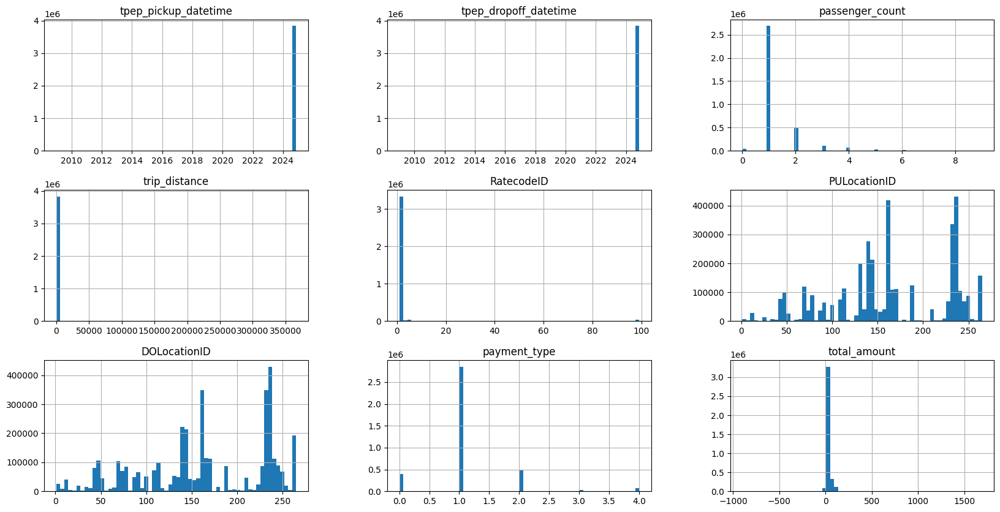
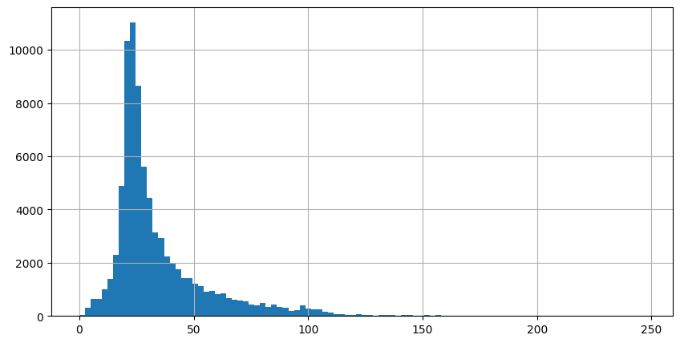

# New York Taxi Analysis Project

In this Data Analysis/Machine Learning project I play with the New York Taxi dataset.

There is a streamlit app to test the model and predict outputs. It can be started using

```shell
streamlit run web_app.py
```

## Problem Definition

Predict the average money spent on taxi rides for each region of New York per given day and hour.

This problem is a Supervised Regression problem.

- Supervised: We have the actual values that we are trying to predict (in the train dataset)
- Regression: We are trying to predict a continuous value (as opossed to categorical)

## The Dataset

This project uses the `TLC Trip Record Data` dataset from `nyc.gov` (The NYC Taxi and Limousine Commission aka TLC).
The public dataset is available for download at [nyc.gov](https://www.nyc.gov/site/tlc/about/tlc-trip-record-data.page)

The dataset contains a total of 3833771 records and 19 columns.

```shell
(3833771, 19)
```

They use `parquet` data format for increased efficiency. See [Apache Parquet documentation](https://parquet.apache.org/docs/) for more details.

Relavent supporting data can be found on the same page as for the dataset download

- [Trip Record User Guide](https://www.nyc.gov/assets/tlc/downloads/pdf/trip_record_user_guide.pdf)
- [Meaning of Column names](https://www.nyc.gov/assets/tlc/downloads/pdf/data_dictionary_trip_records_yellow.pdf)
- [Taxi Zone Lookup Table](https://d37ci6vzurychx.cloudfront.net/misc/taxi_zone_lookup.csv)

## Problems with raw datasets

Here is the histogram of the raw data read from the `data/yellow_tripdata_2024-10.parquet`



It is clear that the dataset contains various illegal values, such as dates earlier than Oct 2024, despite being a Oct 2024 dataset.
Also, `passenger_count` is 0 for some records, which seems to be nonsense at first.
A few trips have distances over 50,000 miles which is just ridiculous.
And the most interesting part, `total_amount` is 0 and even negative in some records.

This calls for Data Cleaning and Preprocessing, and it requires a bit of domain knowledge.
By looking at the `Meaning of Column names` document linked above, we see that there is a column called `payment_type`

```
A numeric code signifying how the passenger paid for the trip.
1= Credit card
2= Cash
3= No charge
4= Dispute
5= Unknown
6= Voided trip
```

So there are some rides with disputes and voided trips and even no charge. This justifies 0 and -ve `total_amount`s it seems.

## Data Cleaning

By looking at the number of records having a -ve `total_amount`

```python
print(taxi_data[taxi_data["total_amount"] < 0].shape)
```

```shell
(61426, 9)
```

We see that it is a mere 61k compared to 3 Million records we have. We explore the data a bit more and find out that most of the -ve
`total_amount` are from `payment_type` 3 and 4. Hence we simply drop those records.

But what about very high values, like someone paid $2000 for a taxi trip!
Again by analyzing the data, only 1350 records have payments above $250, so we drop them

Only 22 records have `trip_distance` > 100 miles (that's a lot for taxi). We drop them.

It is very important to not have outliers and false values in the dataset, as it can confuse the model later.
This is why we always collect as much data as we can since real life data will always have "noise" like this

Datasets may also contain missing values. There are cetain approaches to handle those values.
We can fill them in with averages, interpolate existing values, or simply drop them if count is negligible, which is for out case.

Next, we convert the columns to appropriate types such as `datetime`, `float64`, `int32/64`, `boolean` or `object` as suitable for better training results.
It is useful to have `day`, `month` and `hour` columns instead of one `datetime` column, since it yields more features.

Data aggregation is an important step to reduce the number of data points wherever meaningful to provide more information.

## Benchmark Model

Before actually spinning up a ML model training process, we might want to first benchmark out data by making a benchmark model.
This helps us to pre-identify overfitting, underfitting and other unfavorable scenarios.

Features for benchmarking

```python
categorical_features_benchmark = [
    "PULocationID",
    "transaction_month",
    "transaction_day",
    "transaction_hour",
]
# do NOT include trip_distance here, since it directly coorelates with total_amount, and that's cheating actually!
input_features_benchmark = categorical_features_benchmark
target_feature_benchmark = "total_amount"
```

Note that we don't have `trip_distance` as out input features, since it directly co-relates with `total_amount`, the output.
It will act as a cheat for the model and overfit it.

We one-hot encode the input data points.
Then we split the dataset into X_test, X_train, y_test and y_train, and fit a `DecisionTreeRegressor` on the cleaned dataset.

The results were as follows

```shell
mean absolute error 12.616090392101823
mean squared error 357.68911713379254
root mean squared error 18.91267080911082
r2 0.2347719420857315
```

As we can see it actually performed quite well on the benchmark model, but not too good.
Hence we need to actually introduce some new features to the dataset.

## Feature Engineering

We add new features to the dataset such as `weekday`, `weekend` and `is_holiday` to help the model draw more info from the data points.
This helps the model to understand the date values much more.
Feature engineering is cruicial since it requires real world knowlegde about the domain to introduce new and meaningful features to the dataset.

Here, the weekday or whether the day was a weekend or a holiday will affect out result to a high degree since people tend to go out on holidays
or office workers won't take a morning taxi on weekdays.
We can use the `USFederalHolidayCalendar` from `pandas.tseries.holiday` to automatically insert the column into out dataset.

We can add more features to the dataset in a similar way.

## Model Training

Now we actually begin to train out model.

Final Features for training.

```python
categorical_features = [
    "PULocationID",
    "transaction_month",
    "transaction_day",
    "transaction_hour",
    "transaction_week_day",
    "weekend",
    "is_holiday",
    "Borough",
]
input_features = categorical_features
target_feature = "total_amount"
```

Final training results (models used, mean absolute error, root mean square error and r2 scores) are tabulated below"

| Algorithm              |   MAE |  RMSE |   R2 |
| :--------------------- | ----: | ----: | ---: |
| Benchmark Model        | 12.61 | 18.90 | 0.23 |
| Decision Tree          | 10.78 | 17.64 | 0.36 |
| Random Forest          |  9.82 | 17.04 | 0.40 |
| Hist Gradient Boosting |  9.62 | 15.95 | 0.47 |

We can iterate over on any of the steps again to improve the model, but this is a good checkpoint.
So we save the currenly best performing model to use it in other applications.

```python
with open("taxi_regression_model.pkl", "wb") as file:
    pickle.dump(model_at_hand, file)
```

Further steps include fine tuning the model by finding the best hyperparameters, which I may do at some point.

## A Classification Problem

This problem can be turned into a whole new classification problem.

### Problem Definition

Classify the earnings of taxi drivers for each ride for each region of New York per given day and hour.

Classification into

- Low (< $25)
- High (>= $25)

This problem is a Supervised Classification problem.

- Supervised: We have the actual values that we are trying to predict (in the train dataset)
- Classification: We are trying to predict a discrete value (0 or 1)

We can simply add a new feature called `earning_class` containing 0 or 1 if `total_amount` is < 25 or >= 25.

```python
nyc_class["earning_class"] = data_with_new_features["total_amount"].apply(lambda x: "low" if x <= 25 else "high")
nyc_class["earning_class_binary"] = nyc_class["earning_class"].apply(lambda x: 0 if x == "low" else 1)
```

We used the `total_amount` histogram for finding the appropriate split point.



$25 results in a very even split

```shell
earning_class
high    45671
low     34165
Name: count, dtype: int64
```

Now we train a classification model on these features, such as `RandomForestClassifier`

```python
categorical_features = [
    "PULocationID",
    "transaction_month",
    "transaction_day",
    "transaction_hour",
    "transaction_week_day",
    "weekend",
    "is_holiday",
    "Borough",
]
input_features = categorical_features
target_feature = "earning_class_binary"
```

This results in an overall nice score

```shell
[[ 7600  3717]
 [ 3313 11716]]
accuracy 0.7331663250588325
precision 0.759152465496015
recall 0.7795595182646883
```

and finally we save the model for later use

```python
with open("taxi_classification_model.pkl", "wb") as file:
    pickle.dump(clf, file)
```
